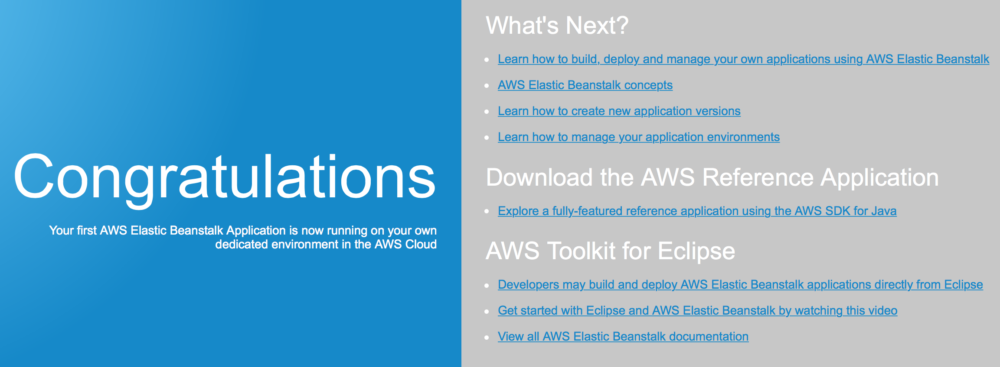

# Tutorial

This tutorial will show you how to deploy two toy Java applications into a single Elastic Beanstalk container.

## Step 1: Create a directory for your application and navigate to that directory

We'll call this `eb-test`.  We assume that you'll do this from the same directory that this `TUTORIAL.md` file is located.  If you do not the instructions later will need to incorporate the proper paths.

```
$ mkdir eb-test
$ cd eb-test
```

## Step 2: Run `eb init` to create your application in Elastic Beanstalk

```
$ eb init
```

I used the following values:

### Region - us-east-1

```
Select a default region
1) us-east-1 : US East (N. Virginia)
2) us-west-1 : US West (N. California)
3) us-west-2 : US West (Oregon)
4) eu-west-1 : EU (Ireland)
5) eu-central-1 : EU (Frankfurt)
6) ap-southeast-1 : Asia Pacific (Singapore)
7) ap-southeast-2 : Asia Pacific (Sydney)
8) ap-northeast-1 : Asia Pacific (Tokyo)
9) sa-east-1 : South America (Sao Paulo)
(default is 3): 1
```

### Application name - eb-test

```
Enter Application Name
(default is "eb-test"): 
Application eb-test has been created.
```

### Platform - Tomcat

```
Select a platform.
1) Node.js
2) PHP
3) Python
4) Ruby
5) Tomcat
6) IIS
7) Docker
8) Multi-container Docker
9) GlassFish
10) Go
(default is 1): 5
```

### Platform version - Tomcat 8 Java 8

```
Select a platform version.
1) Tomcat 8 Java 8
2) Tomcat 7 Java 7
3) Tomcat 7 Java 6
4) Tomcat 7
5) Tomcat 6
(default is 1): 1
```

### SSH - yes

```
Do you want to set up SSH for your instances?
(y/n): y
```

### Keypair - existing

I already had a keypair called aws-eb that I use.  You can reuse an existing one or create a new one.  It shouldn't matter.

```
Select a keypair.
1) aws-eb
2) [ Create new KeyPair ]
(default is 2): 1
```

# Step 3: Create a testing environment

Since no applications are in this directory it will also launch the sample application.  On my system this step took about 4 minutes.

```
$ eb create testing
```

The output you'll see will start with something similar to this:

```
WARNING: The current directory does not contain any source code. Elastic Beanstalk is launching the sample application instead.
Environment details for: testing
  Application name: eb-test
  Region: us-east-1
  Deployed Version: Sample Application
```

Once it is done you'll see this:

```
INFO: Successfully launched environment: testing
```

# Step 4: Validate that the default environment is running

```
$ eb open
```

You should see a page in your web browser that looks like this:



# Step 5: Deploy the first toy application by itself

```
$ ../quick-deploy.py . ../example-applications/application1/
Building ROOT application...
ROOT application built
Deploying application.  This can take a long time.
Application deployed
```

This may take several minutes.  Once it is complete you can verify that it is running by doing this:

```
$ eb open
```

In your browser you should see a simple page that says something like this:

```
This is application1 and it prints out a big random number 1555709810405276531
```

The random number at the end will be different.

At this point you've deployed a single application to a single instance.  Now we'll deploy three applications to the same instance.

# Step 6: Deploy three applications to the same instance

```
$ ../quick-deploy.py . ../example-applications/application1/ ../example-applications/application1/ 1 ../example-applications/application2/ 2
Building ROOT application...
ROOT application built
Building 1 application...
Building 2 application...
Deploying application.  This can take a long time.
Application deployed
```

This took about 4 minutes on my system.  At this point open the application again:

```
$ eb open
```

Make sure that the random number has changed.  This shows that you've got a new instance of the application.

Now add `/1` to the URL in your address bar and load the page.  You should see the same message but again with another new number.  This shows that you have a second copy of the application running at a new path.

Finally replace `/1` with `/2` in the URL in your address bar and load the page.  You should see exactly this message in your browser:

```
This is application2 and it just prints out this message
```

If everything worked out you now have an Elastic Beanstalk configuration that is running three applications in a single instance.  `application1` is running at the root and at the `1` path while `application1` is running at the `2` path.

# Step 7: Terminate your application

Make sure you terminate your application when you're done.

```
$ eb terminate
```

If you forget to do this step Amazon will keep your application running and keep billing you!  If you want to be extra thorough go into the [AWS Elastic Beanstalk console](https://console.aws.amazon.com/elasticbeanstalk/home) and delete the application completely.

You should also go into S3 and delete any files that are left behind.  They don't take up much space but keeping S3 tidy for when you start making real use of Elastic Beanstalk makes sense.